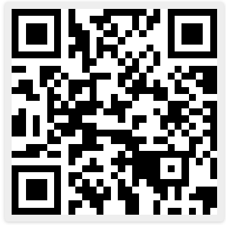

# Find Me App

By Dina Ayoub

## Description

This app shows you a list of their contacts, with two buttons that will show up as appropriate for the given contact: SMS and Email.
When you click on either of those buttons, the app will open up either a text message or an email to that contact and provide them with your location data (latitude and longitude) so you can easily share your location.

Note: If your contact, for example, doesn't have a phone number, you'll only see the Email button

## Usage

1. Download Expo Go on your mobile phone (Android or iOS).
2. Scan this QR code to open my  app:

  
  * in iOS, open your camera app and hover over the QR code. You'll get a notification to open in Expo Go, click that to go to this app.
  * in Android, open your Expo Go app and scan the QR code.